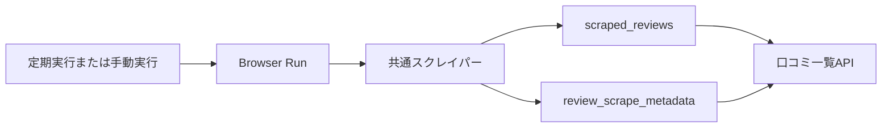

# データベース設計書

## 1. 文書情報

| 項目 | 内容 |
| --- | --- |
| 対象システム | Tabelog Writer |
| データベース | Cloudflare D1 |
| SQL互換性 | SQLite |
| 正本 | `migrations/`配下のSQL |

## 2. 現在使用するテーブル

| テーブル | 役割 | 主キー |
| --- | --- | --- |
| `scraped_reviews` | 食べログから取得した口コミを保存する | `id` |
| `review_scrape_metadata` | 口コミの最終取得日時を保存する | `id` |

### 2.1 `scraped_reviews`

| カラム | 型 | NULL | 制約 | 内容 |
| --- | --- | --- | --- | --- |
| `id` | TEXT | 不可 | PRIMARY KEY | 口コミ詳細URL由来のID |
| `restaurant_name` | TEXT | 不可 | なし | 店舗名 |
| `restaurant_url` | TEXT | 不可 | なし | 店舗ページURL |
| `detail_url` | TEXT | 不可 | UNIQUE | 口コミ詳細URL |
| `title` | TEXT | 可 | なし | 口コミタイトル |
| `body` | TEXT | 可 | なし | 口コミ本文 |
| `review_date` | TEXT | 不可 | `YYYY-MM` | 訪問年月 |
| `rating` | REAL | 不可 | 0以上5以下 | 評価値 |
| `like_count` | INTEGER | 不可 | 0以上 | いいね数 |
| `scraped_at` | TEXT | 不可 | なし | 取得日時 |

### 2.2 `review_scrape_metadata`

| カラム | 型 | NULL | 制約 | 内容 |
| --- | --- | --- | --- | --- |
| `id` | INTEGER | 不可 | PRIMARY KEY、1固定 | メタデータ行のID |
| `last_updated_at` | TEXT | 不可 | なし | 最終取得日時 |

## 3. 更新方法

`scraped_reviews`と`review_scrape_metadata`は、D1のバッチ処理でまとめて更新する。途中のSQLが失敗した場合は全体をロールバックし、更新前の口コミを維持する。

## 4. 未使用の既存テーブル

`migrations/0001_initial_schema.sql`で作成された次のテーブルは、廃止した口コミ生成機能向けであり、現在のコードからは使用しない。

- `writing_samples`
- `style_profiles`
- `drafts`

既存データを失う可能性があるため、機能削除と同時にはDROPしない。削除する場合は、バックアップと利用状況を確認したうえで別のマイグレーションとして実施する。

## 5. マイグレーション運用

- 適用済みマイグレーションは書き換えない。
- スキーマ変更は新しい連番ファイルとして追加する。
- 本番適用前に対象データとロールバック方法を確認する。
- D1への適用は`wrangler d1 migrations apply`を使用する。
