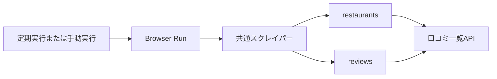

# データベース設計書

## 1. 文書情報

| 項目 | 内容 |
| --- | --- |
| 対象システム | Tabelog Writer |
| データベース | Cloudflare D1 |
| SQL互換性 | SQLite |
| 正本 | `migrations/`配下のSQL |

## 2. 現在使用するテーブル

| テーブル | 役割 | 主キー |
| --- | --- | --- |
| `restaurants` | 店舗名と店舗URLを保存する | `url` |
| `reviews` | 食べログから取得した口コミを保存する | `id` |

### 2.1 `restaurants`

| カラム | 型 | NULL | 制約 | 内容 |
| --- | --- | --- | --- | --- |
| `url` | TEXT | 不可 | PRIMARY KEY | 店舗ページURL |
| `name` | TEXT | 不可 | なし | 店舗名 |

### 2.2 `reviews`

| カラム | 型 | NULL | 制約 | 内容 |
| --- | --- | --- | --- | --- |
| `id` | TEXT | 不可 | PRIMARY KEY | 口コミ詳細URL由来のID |
| `restaurant_url` | TEXT | 不可 | FOREIGN KEY | `restaurants.url`を参照する店舗ページURL |
| `detail_url` | TEXT | 不可 | UNIQUE | 口コミ詳細URL |
| `title` | TEXT | 可 | なし | 口コミタイトル |
| `body` | TEXT | 可 | なし | 口コミ本文 |
| `review_date` | TEXT | 不可 | `YYYY-MM` | 訪問年月 |
| `rating` | REAL | 不可 | 0以上5以下 | 評価値 |
| `like_count` | INTEGER | 不可 | 0以上 | いいね数 |
| `scraped_at` | TEXT | 不可 | なし | 取得日時 |

## 3. 更新方法

`reviews`と`restaurants`は、D1のバッチ処理でまとめて全件入れ替える。途中のSQLが失敗した場合は全体をロールバックし、更新前の口コミを維持する。最終取得日時は`reviews.scraped_at`の最大値から取得する。

## 4. マイグレーション運用

- 適用済みマイグレーションは書き換えない。
- スキーマ変更は新しい連番ファイルとして追加する。
- 本番適用前に対象データとロールバック方法を確認する。
- D1への適用は`wrangler d1 migrations apply`を使用する。
