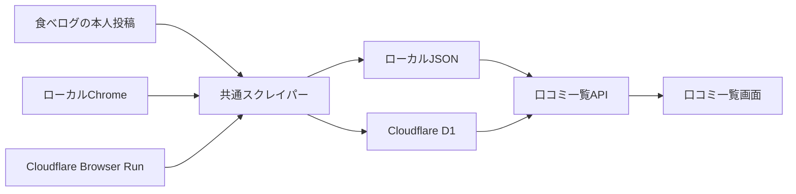

# 食べログ口コミ収集・閲覧システム 設計書

## 1. 目的

本人が食べログへ投稿した口コミを収集し、ローカルまたはCloudflare上で一覧表示する。

## 2. 設計方針

1. 食べログ固有の巡回・抽出処理を実行環境から分離する。
2. ブラウザーの起動方法と保存先をインターフェースで切り替える。
3. 取得結果を検証してから保存し、不完全なデータで既存データを置き換えない。
4. 食べログへの投稿や文章生成は行わない。
5. 異常を隠すフォールバックは実装しない。

## 3. スコープ

### 3.1 対象

- 本人が投稿した口コミの収集
- 口コミ詳細URLに基づく安定したIDの生成
- ローカルJSONへの保存
- Cloudflare Browser Runによる収集
- Cloudflare D1への保存
- 口コミ一覧画面と一覧API
- WorkerのヘルスチェックAPI

### 3.2 対象外

- 口コミ文章の生成
- 食べログへの自動投稿
- 他者の口コミ収集
- 複数利用者への提供
- 画像解析

## 4. システム構成

### 4.1 ローカル

- PlaywrightでローカルChromeを起動する。
- 取得結果を`data/reviews.json`と`data/reviews-meta.json`へ保存する。
- 口コミ一覧APIはJSONを参照する。

### 4.2 Cloudflare

| サービス | 責務 |
| --- | --- |
| Worker | APIと定期実行ハンドラーを提供する |
| Static Assets | React画面を配信する |
| Browser Run | 食べログを巡回する |
| D1 | 口コミと最終取得日時を保存する |

## 5. データ

| 項目 | 内容 |
| --- | --- |
| `id` | 口コミ詳細URL由来のID |
| `name` | 店舗名 |
| `url` | 店舗ページURL |
| `detailUrl` | 口コミ詳細URL |
| `title` | 口コミタイトル。取得できない場合は`null` |
| `body` | 口コミ本文。取得できない場合は`null` |
| `reviewDate` | 訪問年月。`YYYY-MM`形式 |
| `rating` | 評価値 |
| `likeCount` | いいね数 |

## 6. API

| メソッド | パス | 用途 |
| --- | --- | --- |
| `GET` | `/api/health` | Workerの生存確認 |
| `GET` | `/api/reviews` | 口コミ一覧と最終取得日時の取得 |

`/api/health`はD1などの外部依存サービスを確認しない。依存サービスの一時障害とWorker自体の障害を分けるためである。

## 7. 更新処理

1. ブラウザーを起動する。
2. 食べログの一覧ページと詳細ページを巡回する。
3. 取得結果を検証する。
4. ローカルではJSON、本番ではD1へ保存する。
5. D1では口コミと最終取得日時をバッチで更新する。

途中で失敗した場合は保存処理を完了せず、既存データを維持する。

## 8. エラー方針

- ページ取得時のHTTPステータスが正常でない場合は停止する。
- 口コミ情報や数値を正しく取得できない場合は停止する。
- D1への一括保存に失敗した場合は既存データを維持する。

## 9. 検証

- 型チェックと本番ビルドが成功する
- `/api/health`がHTTP 200を返す
- `/api/reviews`が口コミ一覧を返す
- 収集失敗時に既存データが維持される
