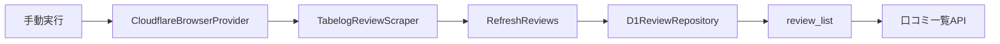

# Tabelog Writer

本人が食べログへ投稿した口コミを収集し、一覧で確認する個人用アプリです。

- 画面：React、Vite、Tailwind CSS、daisyUI
- API：TypeScript、Hono、Cloudflare Workers
- 口コミ収集：Cloudflare Browser Run
- 保存：Cloudflare D1

## 口コミの取得項目

| 項目 | 型 | 内容 |
| --- | --- | --- |
| `id` | `string` | 口コミ詳細URL由来のID |
| `name` | `string` | 店舗名 |
| `url` | `string` | 店舗ページURL |
| `detailUrl` | `string` | 口コミ詳細URL |
| `title` | `string \| null` | 口コミタイトル |
| `body` | `string \| null` | 省略されていない口コミ本文 |
| `reviewDate` | `string` | 訪問年月。`YYYY-MM`形式 |
| `rating` | `number` | 投稿者が付けた点数 |
| `likeCount` | `number` | 口コミへのいいね数 |

食べログが公開している日付は訪問年月までのため、存在しない日を補完しません。

## スクレイピング構成

食べログの巡回・抽出処理はCloudflare上で実行し、取得結果をD1へ保存します。



ローカル開発と本番のどちらでも、口コミ一覧APIはD1の`review_list`ビューを参照します。`wrangler.jsonc`のD1バインディングは`remote`のため、ローカル開発でもリモートD1へ接続します。

## セットアップ

```bash
npm install
```

`.dev.vars`を作成し、ローカル実行用の値を設定します。

```text
TABELOG_USERNAME="食べログのユーザー名"
```

`TABELOG_USERNAME`には、口コミを取得する食べログユーザーのURL上の名前を設定します。本番では`wrangler.jsonc`の値が使用されます。

Browser RunとD1は`wrangler.jsonc`でリモートバインディングとして設定されています。ローカルから利用した場合もCloudflare側の利用量に加算されます。

## アプリのローカル起動

```bash
npm run dev
```

表示されたURLを開きます。口コミ一覧はリモートD1から読み取ります。

## ヘルスチェック

Workerがリクエストを処理できることは、次のAPIで確認できます。

```bash
curl -i "http://localhost:5173/api/health"
```

正常時はHTTP 200と次のJSONを返します。D1などの外部依存サービスは確認しません。

```json
{"status":"ok"}
```

## 本番D1の手動更新

本番D1を更新する場合は、Wranglerの開発サーバーを使用して手動で実行します。

```bash
npm run dev:worker
```

別のターミナルからScheduled Handlerを呼び出します。

```bash
curl "http://localhost:8787/cdn-cgi/handler/scheduled"
```

起動時のバインディング一覧で`env.DB`が`remote`になっていることを確認してください。`local`の場合は本番D1に反映されません。

この処理は次の順序で動作します。

1. Browser Runでブラウザーを起動する
2. 食べログの一覧と詳細ページを巡回する
3. 取得結果をD1のトランザクションで全件入れ替える
4. 最終更新日時を保存する

処理途中で失敗した場合、D1の既存口コミは置き換わりません。

## ビルドとデプロイ

初回またはマイグレーション追加時は、Workerより先にリモートD1へ適用します。

```bash
npx wrangler d1 migrations apply dining-archive-db --remote
npm run build
npm run deploy
```

デプロイ後も口コミは自動取得されません。リモートD1を更新する場合は、前述の手動更新を実行します。

## 主なファイル

```text
.
├── migrations/
│   ├── 0001_initial_schema.sql
│   └── 0002_add_review_list_view.sql
├── src/
│   ├── reviews/
│   │   ├── review.ts
│   │   ├── refresh-reviews.ts
│   │   └── tabelog-review-scraper.ts
│   ├── infrastructure/
│   │   ├── cloudflare-browser-provider.ts
│   │   └── d1-review-repository.ts
│   ├── react-app/
│   └── worker/
│       ├── review-refresh-factory.ts
│       └── index.ts
├── wrangler.jsonc
└── package.json
```

### ファイルごとの役割

| ファイル | 役割 |
| --- | --- |
| `migrations/0001_initial_schema.sql` | `restaurants`と`reviews`のテーブル、制約、インデックスを作成する |
| `migrations/0002_add_review_list_view.sql` | 口コミ一覧APIが参照する`review_list`ビューを作成する |
| `src/reviews/review.ts` | アプリ内で共通して扱う口コミデータの型を定義する |
| `src/reviews/refresh-reviews.ts` | 口コミの取得とD1への全件保存を順番に実行する |
| `src/reviews/tabelog-review-scraper.ts` | 食べログの一覧・詳細ページを巡回し、口コミデータを抽出・検証する |
| `src/infrastructure/cloudflare-browser-provider.ts` | Browser Runをスクレイパーから利用できる形に変換する |
| `src/infrastructure/d1-review-repository.ts` | 口コミをD1へ保存し、`review_list`ビューから一覧を取得する |
| `src/worker/review-refresh-factory.ts` | Browser Run、スクレイパー、D1を組み合わせて口コミ更新処理を作る |
| `src/worker/index.ts` | APIルート、エラー処理、Scheduled Handlerを定義するWorkerの入口 |
| `src/react-app/main.tsx` | Reactアプリを初期化し、ルーターを有効にする |
| `src/react-app/App.tsx` | `/reviews`へのルーティングを定義する |
| `src/react-app/pages/ReviewListPage.tsx` | APIから口コミを取得し、訪問年月順または評価順で一覧表示する |
| `src/react-app/styles.css` | Tailwind CSSとdaisyUIを読み込み、画面全体のスタイルを定義する |
| `wrangler.jsonc` | Worker、Browser Run、D1、静的ファイル配信の設定を管理する |
| `package.json` | npmコマンドと利用パッケージを管理する |

## エラーとして停止する条件

- ページ取得時のHTTPステータスが正常でない
- 一覧から口コミ情報を取得できない
- 訪問年月が`YYYY/MM 訪問`形式ではない
- 点数またはいいね数を数値へ変換できない
- 全投稿でいいね要素が見つからない
- D1への一括保存が失敗する

食べログ側のHTML構造変更を空データとして保存せず、既存データを維持するための条件です。

## 注意事項

- 食べログ側のHTML構造が変わると、CSSセレクターの修正が必要です。
- Browser RunからのアクセスはBotとして識別されます。対象サイトの判断により取得できなくなる可能性があります。
- 実行頻度、取得データの範囲、利用方法について対象サイトの利用条件を確認してください。
- Browser Runの利用量はCloudflareダッシュボードで確認してください。
