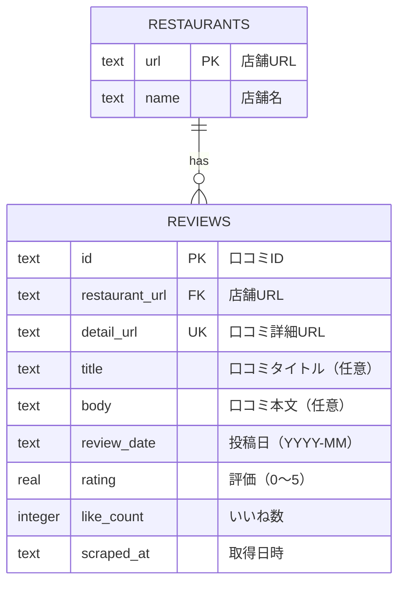

# データベースER図

現在のD1データベースは、店舗と口コミを分離した第三正規形（3NF）です。

## 制約

- `restaurants.url`を店舗の主キーとする
- `reviews.id`を口コミの主キーとする
- `reviews.restaurant_url`は`restaurants.url`を参照する
- `reviews.detail_url`は一意とする
- `rating`は0以上5以下とする
- `like_count`は0以上とする
- `review_date`は`YYYY-MM`形式とする
- 外部キー`reviews.restaurant_url`にインデックスを持つ
- `reviews.review_date`の降順インデックスを持つ

## 設計方針

店舗名は`restaurants`だけに保持し、口コミから外部キーで参照します。各非キー属性は、そのテーブルの候補キーだけに依存するため、第三正規形を満たします。
